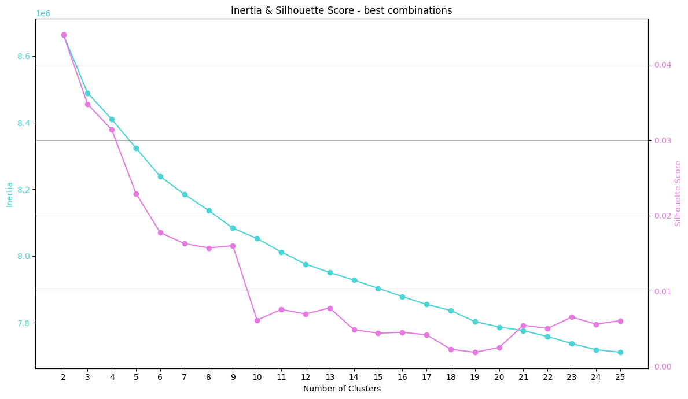

# Toxic Comment Classification
[Kaggle dataset](https://www.kaggle.com/competitions/jigsaw-toxic-comment-classification-challenge/data?select=train.csv.zip)

**GOAL:** topic modeling of toxic comments.  
**RESULT:** 4 clusters of toxic comments (embeddings `LaBSE` to `K-Means`)

---
## Architecture


#### EDA

The features:
1. id
2. comment_text
3. binary categories (toxic	severe_toxic, obscene	threat, insult, identity_hate)

The new binary category `neutral` was created. Dataset is imbalanced.


Only toxic comments were used for modeling. Toxic data is imbalanced too.


### Embeddings

```python
tokenizer = AutoTokenizer.from_pretrained('cointegrated/LaBSE-en-ru')
model = AutoModel.from_pretrained('cointegrated/LaBSE-en-ru').to(device)
```

### K-Means

The silhouette score is very small for any number of clusters. After 4 clusters the value of this score changes dramatically.



#### 4 clusters in 3D
  


### Created clusters

> Swear words have been censored with `%`

#### Wordcloud of cluster №1

Sample №1: i nearly get blocked? lol. i didn't broke any rule, i even was reported for breaking the wp:rr and i didn't get blocked because i didn't broke it. check the log. you even asked spellcast to block me because you're not thinking clearly. how is he going to block when i haven't done anything wrong? you mad? it's a zero!

Sample №2: if people revert my edits for no good reason, i get pissed off. don't you? and if someone is so utterly retarded as to somehow mistake them for vandalism, and to then leave a message here to say so, i think that is far more abusive than merely using a swear word. ...

Sample №3: just as well that this ""isn't a problem"", as your imbecilic behaviour has gotten you added to the target list! whilst i'm here, let good ol' mr slick know that i have put th june in my diary. i'll be there the second that s-protection expires to sort his talk page out. ...

Sample №4: wow holy fuck this girl is hot as hell. i know we aren't supposed to put things like this on talk pages, so you can delete this, but seriously man. instant boner whenever i see her. and i'm not even black or anything, nor do i have some kind of black fetish. just wow.

Sample №5: it is true! ask a local! seriously, us aylesfordians hate it when people say our dear village, which was the first in the uk, covers larkfield, eccles and all of that other shit. those are seperate villages. and that's final. ...


#### Wordcloud of cluster №2

Sample №1: he can go f%ck himself sideways with a spiky spoon.  
Sample №2: oi will you f%ck off?????  
Sample №3: you are a pathetic, lifeless f%ck.  
Sample №4: so many children to abuse so little time  
Sample №5: you can f%ck off too, you twatus majorus.


#### Wordcloud of cluster №3

Sample №1: levantine arabs are white you complete moron the white latin american page has shakira's photo who is half-arab

Sample №2: time cube you have been educated singularity stupid you mindless academic cannibal.

Sample №3: douche? dear s, be you a douchec%ck? i believe it doubly so.

Sample №4: stop being a shithead, or i will rip off your head and piss down your esophagus, mother f%cker. we came in?

Sample №5: fap so i herd u were still a f%cking wanker. is this true? (ps: guess who, ?)


#### Wordcloud of cluster №4

Sample №1: this article s%cks i would nominate it for deletion if it wasn't protected.

Sample №2: your recent stupidity please refrain from being stupid. your recent ignorance has been reverted. next time you try to supress the truth you will be blocked. thank you, the truth teller

Sample №3: the article clearly s%cks.

Sample №4: reignman is a really ignorant person, and a perfect example of why wikipedia is not to be trusted.

Sample №5: excuse me??? are u alowed to talk to me that way? i am not a troll i am a human being. u racist.


### Description of clusters

**Cluster №1:**
- Insulting, but often sarcastic.
- Uses slang, phrases like "lol", "check the log", "it's a zero".
- The comments are quite long, consisting of several sentences.

**Cluster №2:**
- Short comments.
- Very rough, straight (the rudest cluster).
- Lots of swear words.

**Cluster №3:**
- Use of various intolerant stereotypes.
- Angry comments with offensive epithets.

**Cluster №4:**
- Less swear words.
- More literate than in other clusters.
- Objective - to discredit the opponent